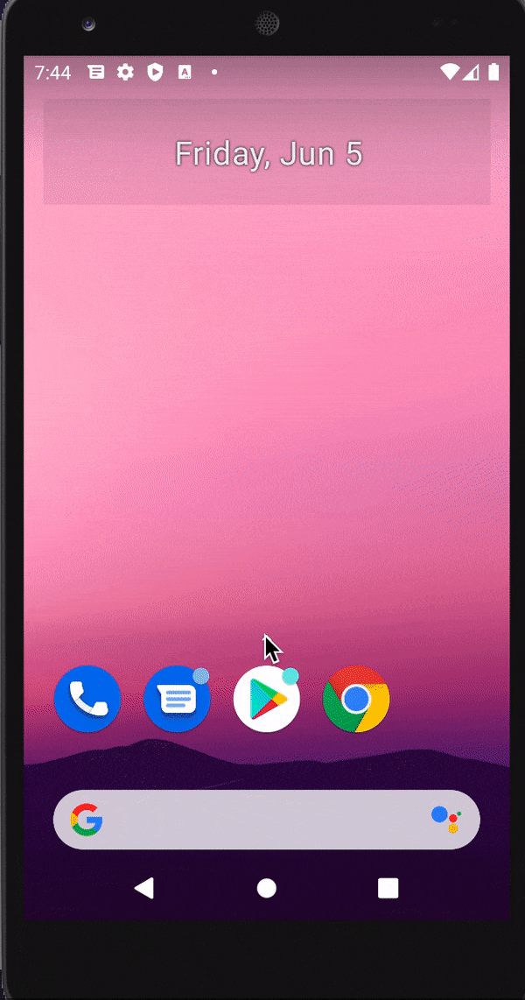

FT_HANGOUT

Introduction :  
  
  >> Ft_hangout is the only android project of the school 42. 
  >>The project make us design a app, that allow to create contact and send text message.
  
Restriction: 

>> This project have to been done with the help of Java or Kotlin language (i pick Java). 
>> You can add , edit or delete contact. 
>> Contact need to have at least 5 field of information. 
>> You can send message to the contact. 
>> You have on the main page a summary of all contact. 
>> You can check all information of a contact by selecting the contact. 
>> Contact have to be saved in a SQLite database. 
>> The app need to work with at least two language. 
>> The app have a option to let you change the color of the header. 
>> The logo of the app is the 42 logo. 
>> When the app go in pause, it should save the current time and display it when it return. 
>> You cannot use external library. 

